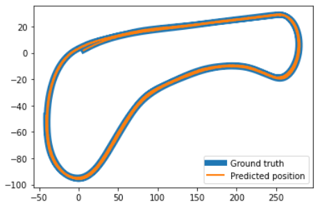

# rust-particle-filter
Basic [particle filter](https://en.wikipedia.org/wiki/Particle_filter) implementation for sparse mapping in Rust.

This is a Rust implementation of a particle filter accepting (lidar) observation coordinates and a sparse map. The design is inspired by  by the C++ [implementation](https://github.com/udacity/CarND-Kidnapped-Vehicle-Project) and the provided data set is obtained from the [simulator](https://github.com/udacity/self-driving-car-sim/releases) for the [Udacity](https://udacity.com/drive) self-driving car program.

Disclaimer: This is my first Rust program - while the initial commit is functional, I have not yet cleared all warnings and have yet to find more rustic/elegant solutions for several parts.
While this is hardly optimized code, it runs ~600-800x faster on my laptop than my C++ implementation - though the latter ran worked with the simulator linked above, not consuming the data from file. Running this on an outdated laptop for all 2440 data sets, it takes ~160ms in release mode, and ~2.5s in debug mode (the C++ version took over 100s).

## Functionality
The lib.rs contains a struct ParticleFilter that, once initialized, predicts the state of its particles `[x,y,φ]` using controls input, calculates the weights of the predicted particles based on (lidar) observations of a sparse set of landmarks, and finally resamples the particles based on their weight.

For testing and demonstration purposes, the main.rs file reads in all necessary data provided in the data/ folder, then initializes an instance of ParticleFilter and loops over all observations. A csv log file is saved for convenience, containing predicted and true vehicle states. The plot shows the output for the parameters used in main.rs.

## Limitations, ToDo

* The struct currently only allows for one sensor, having only one field for localization/measurement error. Extending this to a vector of measurement data and errors should be straightforward.
* No functional tests are currently implemented.
* Error handling is very basic - file operations are caught, but I made use of `ok()` or `unwrap()` for sorting/filtering. This should be improved when working with unknown data. Having no landmarks within sensor range would almost certainly cause a panic as is.
* Reverting to `f32` for better performance -- I changed to `f64` because `fold()` is not implemented on the former, but I ended up not using it after all.
